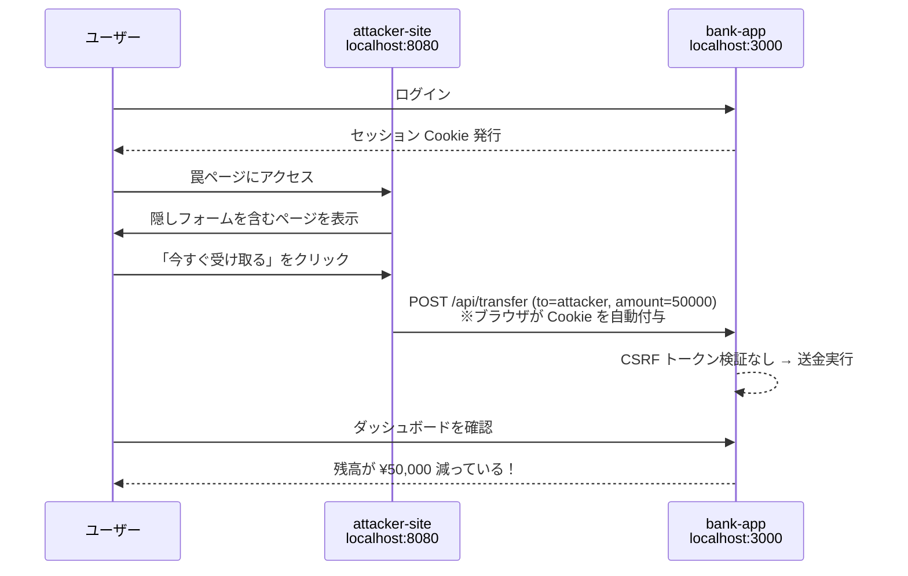

# CSRF 攻撃体験デモ

CSRF（Cross-Site Request Forgery）を安全に体験・学習できる Docker 環境です。

銀行風の Web アプリに対して、攻撃者サイトから不正送金を実行することで、CSRF の脅威を実感できます。

## 構成

| サービス | 技術 | ポート | 役割 |
|---|---|---|---|
| bank-app | Next.js (App Router) | `localhost:3000` | 銀行アプリ（CSRF 対策なし） |
| attacker-site | nginx | `localhost:8080` | 攻撃者の罠ページ |



## 使い方

### 1. 起動

```bash
docker compose up --build
```

### 2. 銀行アプリにログイン

http://localhost:3000 を開き、テストアカウントでログインします。

| ユーザー名 | パスワード | 初期残高 |
|---|---|---|
| alice | alice123 | ¥100,000 |
| bob | bob123 | ¥50,000 |

ダッシュボードで残高を確認してください。

### 3. 罠ページにアクセス

**別のタブで** http://localhost:8080 を開きます。

「おめでとうございます！」という当選ページが表示されます。
「今すぐ受け取る」ボタンをクリックしてください。

### 4. 結果を確認

銀行アプリ（http://localhost:3000/dashboard）に戻り、ページをリロードしてください。

- 残高が ¥50,000 減っている
- 取引履歴に `attacker` への送金が記録されている

**あなたは銀行アプリ上で何も操作していないのに、送金が実行されました。**

### 5. 停止

```bash
docker compose down
```

## なぜ攻撃が成立するのか

1. **セッション Cookie の自動送信** — ブラウザは `localhost:3000` へのリクエストにセッション Cookie を自動的に付与する
2. **CSRF トークンの欠如** — 送金 API がリクエストの送信元を検証していない
3. **HTML フォームの仕様** — `<form>` の POST はクロスオリジンでも送信可能（CORS の制約を受けない）

## 対策

実際のアプリケーションでは以下の対策を組み合わせます。

| 対策 | 説明 |
|---|---|
| **CSRF トークン** | サーバーが発行したトークンをフォームに埋め込み、送信時に検証する |
| **SameSite Cookie** | `SameSite=Strict` を設定し、クロスサイトリクエストに Cookie を付与しない |
| **Origin ヘッダー検証** | リクエストの `Origin` / `Referer` ヘッダーを検証する |
| **カスタムヘッダー** | `X-Requested-With` などの独自ヘッダーを要求する（フォーム送信では付与できない） |

> **補足:** Next.js の Server Actions は Origin ヘッダーを自動検証するため、CSRF に対して耐性があります。このデモでは意図的に API Routes（検証なし）を使用しています。

## 技術的な補足

- `localhost` 同士の通信は同一サイト（same-site）扱いのため、`SameSite=Lax`（ブラウザのデフォルト）でも Cookie が送信されます。異なるドメイン間では `SameSite=Lax` により一部の CSRF が防がれます
- このデモはローカル環境での教育目的です。悪用しないでください
